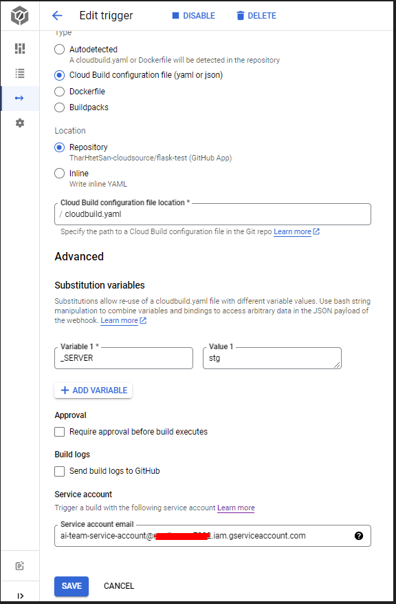

# CI-CD-With-Cloud-Build-on-Compute-Engine

##### Pre-Requisites:

- **flask and docker knowledge.**
- **basic compute engine knowledge.**

#### **How to use:**

1. setup `cloud build trigger` with `Create_MIG_cloudbuild.yaml`.

2. Run the trigger.

3. Edit with `cloud build trigger` with `cloudbuild.yaml`.

   

4. Run the trigger again and check the results.

### Results

#### References:

https://googlecloudcheatsheet.withgoogle.com/

[Koyal Chaudhari's blog post](https://blog.searce.com/ci-cd-with-cloud-build-on-compute-engine-451ccb7b8a1)

[Configuring user-specified service accounts](https://cloud.google.com/build/docs/securing-builds/configure-user-specified-service-accounts)
